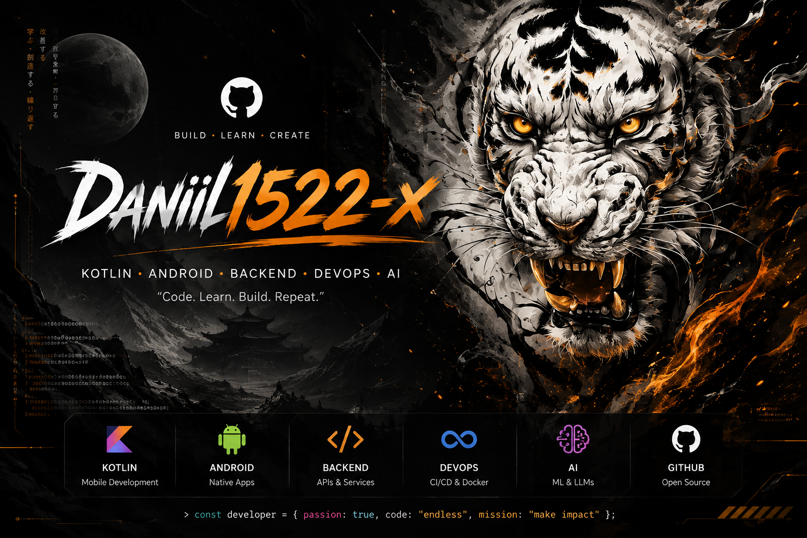

  

<h1 align="center">Daniil1522-x</h1>

  <strong>Software Engineer</strong> 
  AI · Backend · Web · Android · DevOps

  <code>build · learn · create · repeat</code>

---

### About

Multidisciplinary software engineer focused on building systems end-to-end:  
from AI / LLM integrations and backend services to web, Android, and infrastructure.

I work across the stack — designing APIs, shipping mobile and web clients, containerizing services, and wiring CI/CD pipelines.

### Focus areas

| Area | Stack / Topics |
|------|----------------|
| **AI** | LLM integrations, embeddings, agent workflows, Python |
| **Backend** | Go, Python, REST / gRPC, databases, microservices |
| **Web** | Modern frontend, APIs, clean architecture |
| **Android** | Kotlin, Jetpack Compose, native apps |
| **DevOps** | Docker, Linux, GitHub Actions, CI/CD, cloud |

### Currently exploring

- Production-ready AI systems and agent tooling  
- Clean architecture across backend + mobile  
- Reliable deployment pipelines and observability  

### Connect

- GitHub: [Daniil1522-x](https://github.com/Daniil1522-x)

---

  

  Contribution snake · auto-updated daily

